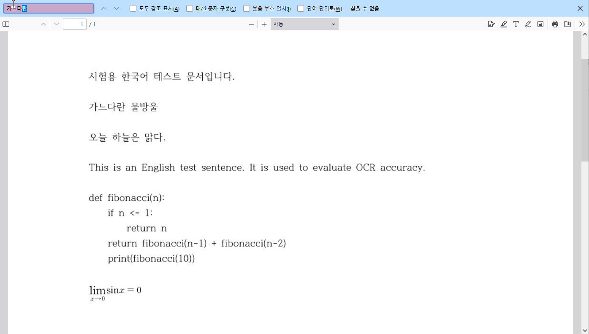
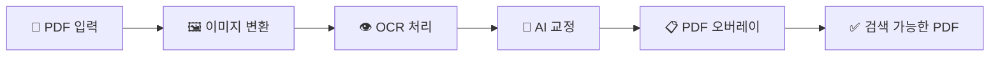
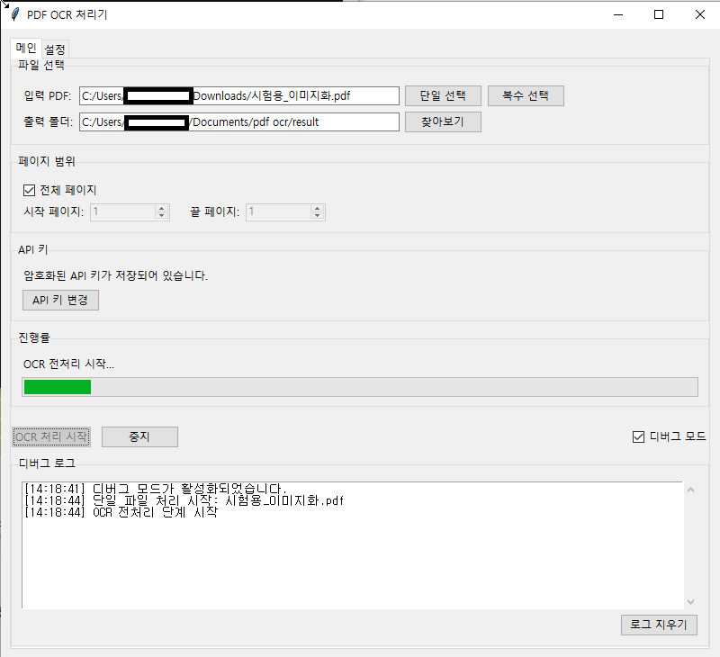
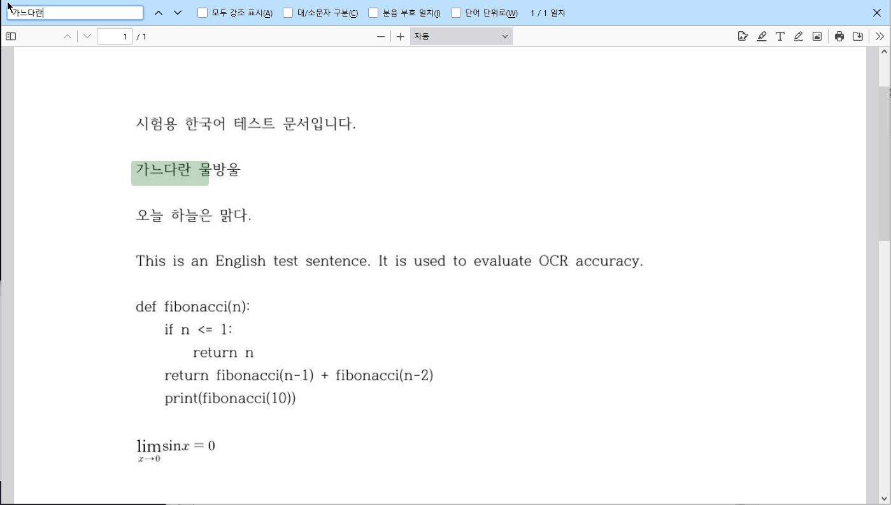
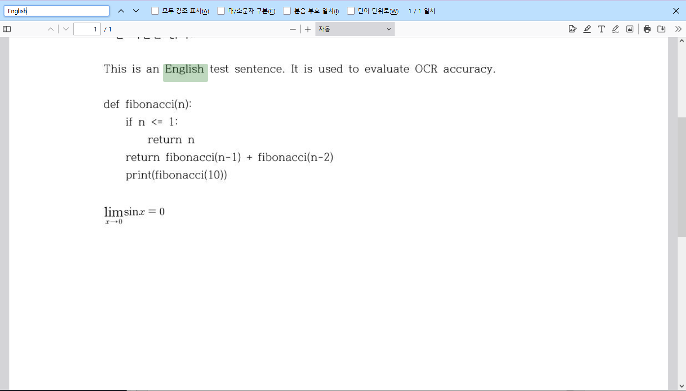
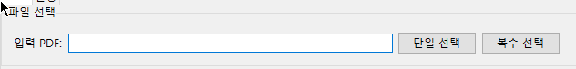
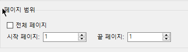

<div align="center">

# 📄 PDF OCR 처리기 by LLM

### AI 기반 PDF 텍스트 복원 도구


*이미지 형태의 PDF를 검색 가능한 텍스트 PDF로 변환하는 파이프라인*

</div>

---

## 📋 목차

- [🎯 프로젝트 개요](#-프로젝트-개요)
- [✨ 주요 기능](#-주요-기능)
- [⚙️ 시스템 요구 사항](#️-시스템-요구-사항)
- [🚀 설치 및 설정](#-설치-및-설정)
- [📖 사용 방법](#-사용-방법)
- [⚠️ 주의 사항](#️-주의-사항)

---

## 🎯 프로젝트 개요

> **이미지 형태로 되어 전혀 검색되지 않는 PDF 문서!** 📚  
> 공부하고 싶은데 답답하죠! 하지만 기존 OCR 도구는 텍스트가 이상하게 인식되거나(파이썬→파이씬 등...) 특수문자로 인식되는 등 검색을 통해 원하는 내용을 찾기 어려운 경우가 많습니다.

**PDF OCR 처리기 by LLM**은 EasyOCR과 OpenAI API를 활용해 PDF 문서의 텍스트(한국어+영어)를 정확하게 추출하고 교정하여 원본 PDF 위에 투명하게 삽입하는 **완전 자동화 파이프라인**입니다.

<div align="center">


*📸 변환 과정 예시*

</div>

### 🔄 처리 파이프라인



1. **PDF → 이미지 변환** (PyMuPDF)
2. **OCR 전처리** (EasyOCR 한글·영어 지원)
3. **AI 기반 텍스트 교정** (OpenAI GPT-4.1-mini)
4. **PDF 오버레이** (PyMuPDF + ReportLab)

### 📊 결과 예시

#### Before



*실행 과정 스크린샷*


<div align="center">

#### After
| *한국어 텍스트 검색 결과* | *영어 텍스트 검색 결과* |
|:---:|:---:|
|  |  |

</div>

---

## ✨ 주요 기능

### 🎯 **스마트 페이지 처리**
- 📄 사용자 지정 페이지 범위 처리 (`start_page` ~ `end_page`)
- 🔄 전체 페이지 일괄 처리 옵션
- ⚡ 고해상도 이미지 변환 (PyMuPDF)

### 👁️ **고정밀 OCR**
- 🌏 다국어 지원 (한국어 `ko` + 영어 `en`)
- 📊 신뢰도 기반 텍스트 블록 분석
- 📝 상세 메타데이터 저장 (좌표, 크기, 신뢰도)

```json
{
  "page": 1,
  "id": "block_001", 
  "text_raw": "원본 OCR 텍스트",
  "confidence": 0.95,
  "x_rel": 0.1, "y_rel": 0.2,
  "w_rel": 0.3, "h_rel": 0.05,
  "font_size": 12
}
```

### 🤖 **AI 기반 교정**
- 🧠 OpenAI GPT-4.1-mini 모델 활용
- 📦 배치 처리로 효율성 극대화
- 🔄 자동 재시도 및 오류 처리
- 📈 토큰 사용량 실시간 모니터링

### 📋 **PDF 오버레이 기술**
- 🎨 투명도 조절 가능한 텍스트 삽입 (`opacity=0.01`)
- 🗜️ 폰트 서브셋팅 및 압축 최적화
- 🇰🇷 한글 폰트 지원 (MalgunGothic)
- 📏 상대 좌표 시스템으로 정확한 위치 매핑

### 🖥️ **사용자 친화적 인터페이스**
- 🎛️ Tkinter 기반 직관적 GUI
- ⚙️ 메인/설정 탭 분리
- 📊 실시간 진행 상황 표시
- 🐛 디버그 모드 지원

---

## ⚙️ 시스템 요구 사항

| 구분 | 요구 사항 |
|:---:|:---|
| **🖥️ 운영체제** | Windows (현재 지원) |
| **🐍 Python** | 3.10 ~ 3.13 (3.13 호환 확인) |
| **💾 메모리** | 최소 8GB RAM 권장 |
| **🔌 GPU** | CUDA 12.8 지원 GPU (선택사항) |

> 💡 **다른 OS 지원**: 테스트 환경을 지원해주실 분이 있다면 이슈 등록 또는 PR을 보내주세요!

---

## 🚀 설치 및 설정

### 1️⃣ Python 환경 준비

```bash
# Python 3.10+ 확인
python --version
```

> 📥 [Python 다운로드](https://www.python.org/downloads/)

### 2️⃣ 의존성 설치

<details>
<summary>🔧 단계별 설치 과정</summary>

#### (1) PyTorch with CUDA 설치
```bash
pip install torch torchvision torchaudio --index-url https://download.pytorch.org/whl/cu128
```

#### (2) 나머지 라이브러리 설치
```bash
pip install -r requirements.txt
```

#### (3) 누락 모듈 추가 설치
```bash
pip install <module_name>
```

</details>

> 💡 **팁**: 가상환경 사용을 권장합니다 (`venv`, `conda`). 
> conda 사용 방법 링크: [Conda 가상환경 설정](https://docs.conda.io/projects/conda/en/latest/user-guide/tasks/manage-environments.html)

### 3️⃣ OpenAI API 키 설정

1. 🔑 [OpenAI 계정](https://platform.openai.com/signup)에서 API 키 발급
2. 🖥️ 메인 → API 키 탭에서 키 입력
3. 💾 "저장" 버튼으로 설정 완료

### 4️⃣ 고급 설정

| 설정 항목 | 기본값 | 설명 |
|:---|:---:|:---|
| 📄 **DPI** | 300 | PDF의 DPI 설정. 잘 모를 경우 그대로 두시면 됩니다.|
| 📦 **배치 사이즈** | 50 | API 호출 단위 |
| 🔄 **최대 재시도** | 3 | 실패 시 재시도 횟수 |
| ⏱️ **타임아웃** | 60초 | API 대기 시간 |
| 🎯 **일일 토큰 한도** | 2,000,000 | 하루 사용 제한 |

#### 🤖 권장 모델 (2025년 기준)

| 모델 | 비용 | 성능 | 추천 용도 |
|:---|:---|:---:|:---|
| **gpt-4.1-mini** ⭐ | 💰 | ⭐⭐⭐ | 일반적인 OCR 교정 |
| **gpt-4.1** | 💰💰💰 | ⭐⭐⭐⭐⭐ | 고품질 교정 필요시 |
| **o4-mini** | 💰 | ⭐⭐⭐⭐ | 시간 여유 있을 때 |
| **gpt-4.1-nano** | 💰 | ⭐⭐ | 초저비용 모델. 실험적 용도 |

---

## 📖 사용 방법

### 🎬 빠른 시작

<div align="center">

```
1. PDF 선택 → 2. 페이지 설정 → 3. OCR 시작 → 4. 결과 확인
```

</div>

### 1️⃣ PDF 파일 선택


*📁 단일/복수 파일 선택 가능*

- **단일 선택**: 페이지 범위 설정 가능
- **복수 선택**: 자동으로 전체 페이지 처리

### 2️⃣ 페이지 범위 설정


*📄 처리할 페이지 범위 지정*

| 옵션 | 설명 |
|:---|:---|
| **시작 페이지** | OCR 시작 지점 (기본: 1) |
| **끝 페이지** | OCR 종료 지점 (기본: 마지막) |
| **전체 페이지** | 시작=끝 설정 또는 복수 선택 시 자동 |

### 3️⃣ OCR 처리 실행

```
🚀 "OCR 처리 시작" 클릭
📊 진행 상황 실시간 모니터링
🐛 디버그 모드로 상세 로그 확인
```

### 4️⃣ 결과 확인

✅ **완료된 PDF 특징**:
- 🔍 원본 위에 투명한 검색 가능 텍스트
- 📁 사전 설정된 출력 폴더에 저장
- 🗜️ 최적화된 파일 크기

---

## ⚠️ 주의 사항

### 🔐 보안 관련

> ⚠️ **중요**: OpenAI API 키는 암호화되어 저장되지만, **절대 유출되지 않도록 주의**하세요!

### 🛠️ 사용 시 주의점

| ⚠️ 주의사항 | 📝 설명 |
|:---|:---|
| **입력값 검증** | 유효하지 않은 값 입력 시 동작 보장 불가 |
| **페이지 수** | 많은 페이지 시 배치 사이즈 조정 필요 |
| **토큰 추정** | 실제보다 20% 과대추정 경향 |

### 💰 비용 관리

> 🚨 **경고**: 고급 모델 사용 시 높은 비용 발생 가능!

**권장 설정**:
- ✅ OpenAI 콘솔에서 사용량 제한 설정
- ✅ 자동 결제 기능 비활성화
- ✅ 일일/월간 한도 설정
- ✅ 실시간 사용량 모니터링

<div align="center">

---

💡 **문제가 있나요?** [Issue 등록](../../issues) | 🤝 **기여하고 싶나요?** [PR 보내기](../../pulls)

**Made with ❤️ for Korean PDF processing**

</div>
